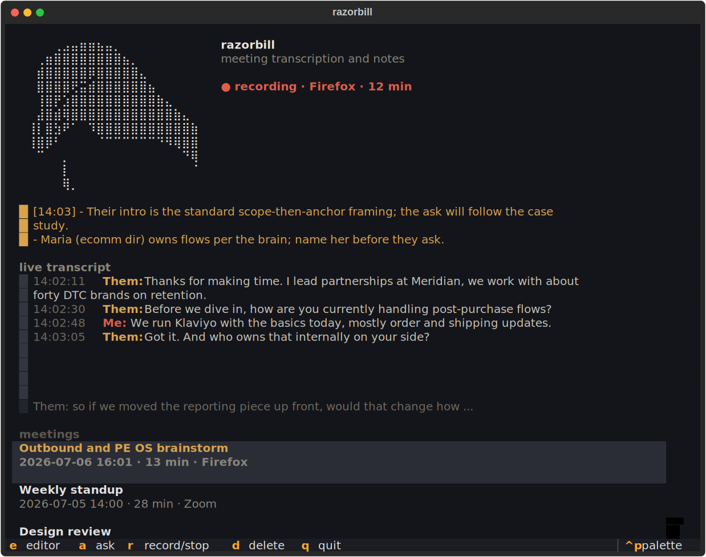

<p align="center">
  <picture>
    <source media="(prefers-color-scheme: dark)" srcset="assets/razorbill-dark.png">
    
  </picture>
</p>

<h1 align="center">razorbill</h1>

Meeting transcription and notes from system audio. Bring your own key: any
OpenAI-compatible endpoint works. TUI, CLI, and a background daemon; notes
are plain Markdown files.

<p align="center">
  
</p>

## How it works

- The daemon records the meeting as two channels: microphone ("Me") and
  system audio ("Them"). Recording starts automatically where supported
  (see platform support) or manually from the TUI or CLI, and stops when
  the meeting ends.
- Afterward, audio segments are transcribed in parallel
  (`gpt-4o-transcribe-diarize` by default, so remote speakers come out as
  "Them (A)", "Them (B)"), merged by timestamp, and passed to a chat model
  (`gpt-5.5` by default) that writes the note: title, summary, decisions,
  action items, open questions, full transcript.
- Output is one Markdown file per meeting in `output_dir`
  (`~/Documents/meetings` by default). Audio is deleted after successful
  transcription; on failure it is kept and `razorbill reprocess` retries.
- Notes jotted during a meeting (TUI or `razorbill note`) are passed to
  the model as anchors to expand.

## Install

```sh
uv tool install razorbill-notes    # or: pipx install razorbill-notes
```

The installed command is `razorbill`. (The name `razorbill` on PyPI belongs
to an unrelated package.) From source: `git clone
https://github.com/armaanpriyadarshan/razorbill && cd razorbill && uv tool
install .`

Requirements: Python 3.11+ and `ffmpeg` on PATH.

## Setup

```sh
razorbill
```

First run prompts for an API key, verifies it against the configured
endpoint, and writes it to `~/.config/razorbill/config.toml` (mode 600).
Alternatives: the `OPENAI_API_KEY` environment variable, or
`api_key_command` for a secret manager. The endpoint defaults to
api.openai.com and is configurable per service (`api_base`,
`transcribe_api_*`, `notes_api_*`), so Groq, local transcription servers,
and other OpenAI-compatible providers are drop-in.

Run the daemon with `razorbill run`, or as a service (a systemd unit ships
in the repo; a launchd agent or scheduled task does the same job
elsewhere).

## Usage

`razorbill` opens the TUI: live daemon status, a jot box during recording,
and the note list with a built-in Markdown reader.

| key | action |
|---|---|
| `enter` / `e` | read note / open in editor |
| `n` | jot into the live meeting |
| `r` | start or stop recording |
| `p` | retry failed processing |
| `q` | quit |

CLI: `status [--json]`, `statusline [--polybar]`, `toggle`, `start`,
`stop`, `note "..."`, `ask "..."`, `last`, `reprocess`, `run`, `bird`.

## Live mode

Off by default. With `live_transcript = true`, the daemon maintains a
rolling transcript (`live.md` in the meeting directory) during the meeting.
Two implementations, selected by `live_mode`:

- `realtime` (default): audio streams to the provider's realtime WebSocket
  endpoint (`gpt-realtime-whisper`) and transcript lines land within a few
  seconds of the words being spoken. Utterance boundaries come from
  server-side voice activity detection. Requires an endpoint that serves
  `/v1/realtime`; the stream reconnects with backoff if it drops.
- `segments`: each recorded audio segment is batch-transcribed as it
  completes, so the transcript lags by up to one segment length. Works with
  any OpenAI-compatible endpoint; segment results are cached and re-used by
  final processing.

The realtime stream is a live view only; the final note is still built by
the batch pipeline over the full recording, which keeps channel separation
and speaker diarization.

On top of the rolling transcript:

- `razorbill ask "..."` (or `a` in the TUI) answers a question against the
  live transcript during a meeting, or against the most recent note after
  one.
- `live_insights = true` adds a proactive pass (at most once per
  `insight_interval` seconds): the model sees the transcript, the
  background documents, and what it already surfaced, and either stays
  silent or pushes at most two short items (a relevant fact about a
  customer just mentioned, a commitment someone made, a question worth
  asking before the call ends). Insights arrive as notifications, in the
  TUI, and in `insights.md`.
- `context_dirs` points at directories of Markdown or text files (a company
  knowledge base, project docs). They ground note generation, `ask`, and
  insights. Small collections are injected whole; larger ones go through a
  selection step where the model picks the relevant files from an index.

Cost: realtime transcription is billed per audio minute for the duration of
the meeting; insights add one chat call per interval.

## Platform support

| capability | Linux | macOS | Windows |
|---|---|---|---|
| automatic meeting detection | yes | no | no |
| manual recording (TUI/CLI) | yes | yes | yes |
| system-audio ("Them") channel | yes | via loopback device | via capture device |
| echo cancellation | yes | no | no |
| notifications | yes | yes | no |
| TUI, notes, configuration | yes | yes | yes |

Automatic detection watches for other applications opening the microphone,
which every meeting app does for the length of a call. On macOS and
Windows, capture devices are named in the config; see
[docs/configuration.md](docs/configuration.md) for the platform device
setup. The macOS and Windows paths are newer than the Linux path and have
seen less testing.

## Configuration

One TOML file; every option has a default. See
[config.example.toml](config.example.toml) and
[docs/configuration.md](docs/configuration.md). Commonly changed:
`transcribe_model`, `notes_model`, `output_dir`, `ignore_apps`,
`notes_prompt_file`. Bar modules and hotkey bindings are in
[docs/desktop-integration.md](docs/desktop-integration.md).

## Scripting and agents

Everything razorbill knows is a file or a one-shot command, which makes it
easy to drive from scripts and coding agents such as Claude Code:

- `razorbill status --json` prints daemon state
  (`{"state": "recording", "app": ..., "since": ...}`).
- Notes are Markdown files with YAML frontmatter in one directory; reading,
  searching, and summarizing them requires no API.
- `razorbill start`, `stop`, `toggle`, and `note "text"` are
  non-interactive and exit non-zero on failure.
- `razorbill last` prints the path of the newest note.

## Privacy

Audio goes to the configured transcription endpoint; transcript text goes
to the configured notes endpoint. Local audio is deleted after
transcription (`keep_audio = false`). No telemetry. Recording calls is
regulated in many jurisdictions; know your local rules.

## Development

`uv sync` for the environment, `uv build` for distributions. One module
per concern: `audio.py` (capture, detection, platform backends),
`daemon.py` (watch loop), `openai_api.py` (stdlib HTTP client),
`transcript.py` (merge, echo dedup), `meeting.py` (post-meeting pipeline),
`tui.py` (Textual interface), `state.py` (file-based IPC). The daemon
imports nothing outside the standard library; Textual is needed only for
the TUI.

Named after the razorbill (Alca torda). `razorbill bird` prints an ASCII
conversion of the reference photograph behind the logo.

## License

MIT.
